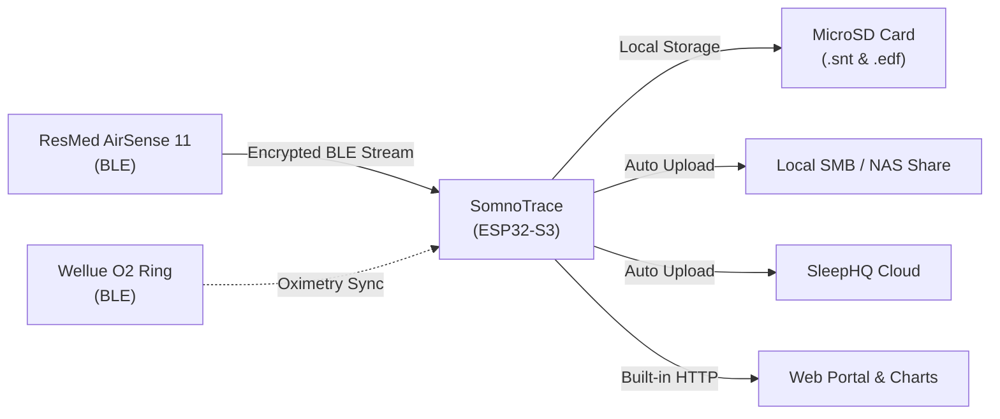

# SomnoTrace

> An open-source ESP32-S3 bridge that pulls sleep-therapy and oximetry data over Bluetooth Low Energy (BLE), writes standard European Data Format (EDF) files, and automatically uploads them to SMB network shares and/or SleepHQ — no SD card swapping required.

Created and architected by **Ilya Kruchinin** ([@ilyakruchinin](https://github.com/ilyakruchinin)).  
Spiritual successor to [CPAP-AutoSync](https://github.com/ilyakruchinin/CPAP-AutoSync), transitioning from a software-only sync to a dedicated, standalone hardware bridge.

---

## Key Goals

- **Eliminate the SD card hassle:** No need to eject and reinsert SD cards daily just to view or upload therapy data. SomnoTrace pulls high-resolution signals and summary spools directly over Bluetooth Low Energy. This also prevents the *"SD Card Error"* messages that some AirSense 11 machines experience when using Wi-Fi-enabled SD cards.
- **Eliminate timestamp drift:** The AirSense 11's internal clock drifts over time, causing misalignment in exported records. SomnoTrace synchronises against network NTP servers, guaranteeing accurate timestamps and alignment with pulse oximeters.
- **Standalone convenience & web dashboard:** Functions as an independent, appliance-like device. Includes an on-device LCD status display with real-time breathing flow graphs, plus a built-in responsive Web UI for viewing graphs, daily stats, and managing configuration.

---

## Hardware Platform


- **Board:** [Waveshare ESP32-S3-Touch-LCD-1.54](https://docs.waveshare.com/ESP32-S3-Touch-LCD-1.54) (touch variant)
- **MCU:** ESP32-S3 (dual-core Xtensa LX7 @ 240 MHz, Wi-Fi 2.4 GHz + BLE 5, 8 MB Octal PSRAM, 16 MB Flash)
- **Display:** 1.54" 240×240 ST7789 SPI LCD with CST816 capacitive touch
- **Audio:** ES8311 DAC codec + NS4150B power amplifier for sound alerts
- **Storage:** MicroSD slot (SDMMC 4-bit mode) for local session storage and EDF files
- **Power:** USB Type-C or rechargeable Li-ion cell with onboard battery monitoring
- **Target Devices:** ResMed AirSense 11 AutoSet / Elite, Wellue O2 Ring S / SleepHQ O2 Ring Pro

<p align="left">
  
  
  
</p>

<br clear="right"/>

---

## How It Works



1. **Connect & Pair:** Connects to the AirSense 11 over BLE using secure SRP-6a authentication and AES-256 session resumption.
2. **Stream Collection:** Captures high-rate therapy data (mask pressure, airflow, leak rate, respiratory events) in real time during therapy.
3. **EDF Synthesis:** On therapy completion, retrieves machine summary spools and generates standard, bit-accurate European Data Format (`.edf`) files matching native SD card layouts.
4. **Automated Upload:** Immediately uploads sessions to configured destination backends (local SMB/Samba share and/or SleepHQ API).
5. **Web Portal & Local Access:** Serves an embedded, dependency-free web dashboard for browsing historical sessions, viewing high-density interactive charts, configuring Wi-Fi / upload credentials, and monitoring system telemetry.

---

## Web UI Dashboard

SomnoTrace includes a self-contained web interface served directly from the ESP32-S3:

<p align="center">
  
</p>

- **Interactive Time-Series Charts:** High-density stacked charts powered by [uPlot](https://github.com/leeoniya/uPlot) for Flow Rate, Mask Pressure, Leak, Respiratory Rate, and SpO2.
- **Session Metrics:** AHI, OAI, CAI, HI, CSR, and 95th/99.5th percentile leak and pressure statistics calculated for individual days or multi-session spans.
- **SoftAP Provisioning:** Generates a captive-portal setup access point on first boot for easy network configuration.
- **OTA Updates:** Upload new firmware images or update directly from GitHub release tags over the web.

---

## Feature Matrix

| Feature | Status | Description |
| :--- | :---: | :--- |
| **AirSense 11 BLE Sync** | ✅ Implemented | Full SRP-6a pairing, AES session resumption, stream recording, and spool extraction. |
| **Standard EDF Generation** | ✅ Implemented | Complete `STR.edf`, `BRP.edf`, `PLD.edf`, `EVE.edf`, and `CSL.edf` creation with CRC-32 validation. |
| **SMB / NAS Upload** | ✅ Implemented | Native SMB2/SMB3 file upload to Windows/Samba network shares via `libsmb2`. |
| **SleepHQ Cloud Upload** | ✅ Implemented | Direct HTTPS multipart upload to SleepHQ API with keep-alive connection pooling. |
| **Web UI & Captive Portal** | ✅ Implemented | Responsive dashboard, session charts, status metrics, and SoftAP provisioning. |
| **LCD & Audio Feedback** | ✅ Implemented | ST7789 display driver with antialiased Roboto font, live flow graph, and ES8311 audio alert tones. |
| **NTP Time Sync** | ✅ Implemented | Accurate wall-clock stamping and timezone mapping (via embedded IANA database). |
| **FTP File Server** | ✅ Implemented | Lightweight background FTP server for direct SD card file management over Wi-Fi. |
| **Wellue O2 Ring Sync** | 🔄 Planned | Direct BLE sync for O2 Ring S / SleepHQ O2 Ring Pro pulse oximetry data. |
| **Therapy Interruption Alarm** | ✅ Implemented | Configurable audio alert if therapy unexpectedly stops during the night. |
| **AirSense 10 Wi-Fi SD Support** | 🔄 Planned | Support for pulling therapy data from AirSense 10 machines using Wi-Fi SD cards. |

---

## Installation & Flashing

### Pre-Built Binaries
Download the latest merged release image (`somnotrace-vX.Y.Z-merged.bin`) from [Releases](https://github.com/ilyakruchinin/SomnoTrace/releases).

Flash using `esptool.py` (or the [ESP Web Flasher](https://espressif.github.io/esptool-js/)):
```bash
esptool.py --chip esp32s3 -p /dev/ttyACM0 -b 460800 write_flash 0x0 somnotrace-v0.7.5-merged.bin
```

### Building from Source (Docker)
Docker is the only host dependency needed to build from scratch:
```bash
# Build firmware and produce merged image in dist/
./scripts/build-dist.sh

# Or flash directly to connected board
./scripts/idf.sh -p /dev/ttyACM0 flash monitor
```

---

## Contributing

Contributions are welcome! Please review [`CONTRIBUTING.md`](CONTRIBUTING.md) before submitting pull requests.

- **Contributor License Agreement:** A [CLA](CLA/individual-cla.md) is required before PRs can be merged (automated on your first PR).
- **Clean-Room Policy:** SomnoTrace is a clean-room implementation based on open protocol documentation. Do not copy third-party source code into this repository.

---

## Acknowledgements

SomnoTrace protocol understanding and interoperability research was informed by the following open-source projects (no code copied — see [`THIRD-PARTY-NOTICES.md`](THIRD-PARTY-NOTICES.md)):

- [airbreak-plus](https://github.com/m-kozlowski/airbreak-plus) — ResMed AirSense 11 BLE protocol reference
- [o2ring-s-protocol](https://github.com/nglessner/o2ring-s-protocol) — Wellue / O2 Ring S BLE protocol reference
- [OSCAR](https://gitlab.com/pholy/OSCAR-code) — European Data Format (EDF) interoperability and statistical metric reference
- [libsmb2](https://github.com/sahlberg/libsmb2) — SMB2/SMB3 client library (LGPL-2.1)
- [esp-idf-ftpServer](https://github.com/nopnop2002/esp-idf-ftpServer) — Embedded FTP server (MIT)
- [uPlot](https://github.com/leeoniya/uPlot) — Fast time-series charting library (MIT)
- [Roboto Font](https://github.com/google/fonts/tree/main/ofl/roboto) — UI typeface (SIL Open Font License 1.1)

---

## License

SomnoTrace is free software released under the **GNU General Public License v3.0** with an author attribution requirement under **GPLv3 Section 7(b)**.

- Full license text: [`LICENSE`](LICENSE)
- Copyright & Section 7(b) Attribution Terms: [`NOTICE`](NOTICE)

Under the GPLv3, you are free to use, modify, and redistribute this software. Any redistributed or derivative works must remain licensed under GPLv3 and preserve the author attribution notice:  
> *"Based on SomnoTrace, originally created by Ilya Kruchinin (https://github.com/ilyakruchinin)."*

---

## Medical Disclaimer

SomnoTrace is an independent open-source project and is **not affiliated with, endorsed by, or associated with** ResMed, Wellue / Viatom, or SleepHQ. It is intended strictly for personal data portability and interoperability research. SomnoTrace is **not a medical device** and must not be used for clinical diagnosis, treatment decisions, or life-critical monitoring. Use entirely at your own risk.
